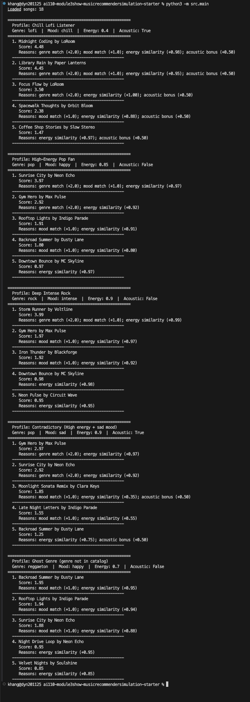

# 🎵 Music Recommender Simulation

## Project Summary

In this project you will build and explain a small music recommender system.

Your goal is to:

- Represent songs and a user "taste profile" as data
- Design a scoring rule that turns that data into recommendations
- Evaluate what your system gets right and wrong
- Reflect on how this mirrors real world AI recommenders

Replace this paragraph with your own summary of what your version does.

---

## How The System Works

### Real-World Recommendations vs. Our Simulation

Real-world platforms like Spotify and YouTube combine collaborative filtering (recommending what similar users enjoyed), content-based filtering (matching audio features like tempo and energy), and deep learning trained on billions of listening signals. Our simulation focuses on the content-based approach: we score each song by how well its attributes match a user's taste profile, keeping the system simple, transparent, and explainable.

### Song Features

Each `Song` uses: **genre**, **mood**, **energy** (0.0–1.0), **tempo_bpm**, **valence** (0.0–1.0), **danceability** (0.0–1.0), and **acousticness** (0.0–1.0), along with **id**, **title**, and **artist**.

### UserProfile Features

Each `UserProfile` stores: **favorite_genre**, **favorite_mood**, **target_energy** (0.0–1.0), and **likes_acoustic** (boolean).

### Algorithm Recipe

Each song is scored against the user profile using these factors:

| Factor | Condition | Points |
|--------|-----------|--------|
| Genre match | `song.genre == favorite_genre` | +2.0 |
| Mood match | `song.mood == favorite_mood` | +1.0 |
| Energy similarity | `1.0 - abs(song.energy - target_energy)` | +0.0 to +1.0 |
| Acousticness bonus | `likes_acoustic AND acousticness > 0.6` | +0.5 |

**Max score: 4.5 | Min score: 0.0**

Songs are sorted by descending score and the top *k* are returned.

### Recommendation Flow

```mermaid
flowchart TD
    A[User Profile] --> B[Load Song Catalog from CSV]
    B --> C[For each song in catalog]
    C --> D{Genre match?}
    D -- Yes --> E[+2.0 points]
    D -- No --> F[+0.0]
    E --> G{Mood match?}
    F --> G
    G -- Yes --> H[+1.0 points]
    G -- No --> I[+0.0]
    H --> J[Energy similarity: 1.0 - |song.energy - target_energy|]
    I --> J
    J --> K{likes_acoustic AND acousticness > 0.6?}
    K -- Yes --> L[+0.5 points]
    K -- No --> M[+0.0]
    L --> N[Sum = total score for song]
    M --> N
    N --> O{More songs?}
    O -- Yes --> C
    O -- No --> P[Sort songs by score descending]
    P --> Q[Return top K songs]
```

### A Note on Potential Biases

- **Genre dominance**: The genre match bonus (+2.0) outweighs all other factors combined (max +2.5 without genre). A song in the user's favorite genre will almost always rank above one that is not, regardless of mood, energy, or acousticness fit.
- **Binary matching**: Genre and mood use exact string matching with no partial credit. A user who likes "lofi" gets zero genre credit for "ambient" or "chill hop", even though those genres are closely related.
- **Small catalog bias**: With only 18 songs, some genres have just one representative. The system cannot distinguish between disliking a genre and simply not having good options in that genre.
- **Arbitrary acousticness threshold**: The 0.6 cutoff for the acoustic bonus is a hard boundary. A song with 0.59 acousticness gets no bonus while 0.61 does, despite being nearly identical.

---

## Getting Started

### Setup

1. Create a virtual environment (optional but recommended):

   ```bash
   python -m venv .venv
   source .venv/bin/activate      # Mac or Linux
   .venv\Scripts\activate         # Windows

2. Install dependencies

```bash
pip install -r requirements.txt
```

3. Run the app:

```bash
python -m src.main
```

### Running Tests

Run the starter tests with:

```bash
pytest
```

You can add more tests in `tests/test_recommender.py`.

---

## Experiments You Tried

### Terminal Output



### Multi-Profile Stress Test

Five profiles were tested (see `src/main.py`):

1. **Chill Lofi Listener** (lofi / chill / 0.4 energy / acoustic) — Top result: Midnight Coding (4.48). Results feel exactly right.
2. **High-Energy Pop Fan** (pop / happy / 0.85 energy) — Top result: Sunrise City (3.97). Gym Hero ranked #2 as expected.
3. **Deep Intense Rock** (rock / intense / 0.9 energy) — Top result: Storm Runner (3.99). Only one rock song in the catalog, so slots 2–5 filled with intense/energetic songs from other genres.
4. **Contradictory** (pop / sad / 0.9 energy / acoustic) — Top result: Gym Hero (2.97). Exposed genre dominance: a gym anthem ranked above actually sad songs.
5. **Ghost Genre** (reggaeton / happy / 0.7 energy) — Top result: Backroad Summer (1.95). No genre matches, so the system fell back to mood + energy only.

### Weight Experiment: Genre Halved, Energy Doubled

Changed genre bonus from +2.0 to +1.0 and energy similarity from x1.0 to x2.0. The top song stayed the same for all profiles, but the gaps narrowed. For the Rock profile, the #1-to-#2 gap shrank from 2.02 to 1.04, allowing more diverse results. The tradeoff: less genre accuracy in exchange for more variety.

---

## Limitations and Risks

- **Genre dominance**: The +2.0 genre bonus means genre-matched songs almost always outrank everything else, even when mood and energy are a poor fit (the Contradictory profile showed this clearly).
- **Tiny catalog**: 18 songs with some genres having only one representative. A rock fan gets one good match and four fallbacks.
- **No genre similarity**: "lofi" and "ambient" are treated as completely unrelated despite being sonically close.
- **Missing genres**: K-pop, Latin, reggae, and many other global genres are absent — the system simply cannot serve those listeners.
- **Binary mood matching**: No partial credit for related moods (e.g., "chill" vs. "relaxed").

---

## Reflection

[**Model Card**](model_card.md) | [**Profile Comparisons**](reflection.md)

Building this recommender showed me that turning data into predictions is fundamentally about choosing which features matter and how much weight each one gets. The +2.0 genre bonus was an arbitrary design choice, but it completely shaped which songs appeared at the top. When I halved genre and doubled energy, the rankings shifted noticeably — not because the songs changed, but because I changed what "good match" means. This is exactly how bias enters real recommender systems: through weight choices that seem neutral but silently favor certain outcomes.

The Contradictory profile was the most revealing test. A user who says they like pop but want sad music at high energy is not unusual — think of dramatic pop ballads or emotional anthems. But the system recommended Gym Hero, a workout song, because genre outweighed mood. This is the kind of subtle failure that real platforms face at scale: the algorithm "works" (genre matched, energy close) but the recommendation feels wrong. It made me realize that fairness in AI is not just about protected groups — it is about whether the system respects the full complexity of what a user actually wants.

