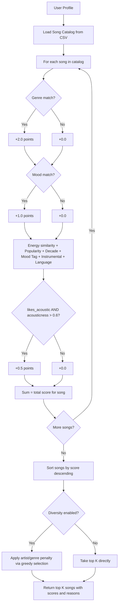

# Music Recommender Simulation

## Project Summary

VibeFinder 1.0 is a content-based music recommender that scores each song in an 18-song catalog against a user's taste profile. The user provides a favorite genre, mood, target energy level, and optional preferences like preferred decade and mood tags. The system scores every song using up to 9 weighted factors, optionally penalizes repeated artists and genres for diversity, and returns the top 5 results in a formatted table with full explanations of why each song was chosen. Four scoring modes (balanced, genre-first, mood-first, energy-focused) let the user switch ranking strategies without changing the code.

---

## How The System Works

### Real-World Recommendations vs. Our Simulation

Real-world platforms like Spotify and YouTube combine collaborative filtering (recommending what similar users enjoyed), content-based filtering (matching audio features like tempo and energy), and deep learning trained on billions of listening signals. Our simulation focuses on the content-based approach: we score each song by how well its attributes match a user's taste profile, keeping the system simple, transparent, and explainable.

### Input Data (Songs)

Each song in `data/songs.csv` is the **input data** the system evaluates. Every song has these attributes:

- **Core features**: genre, mood, energy (0.0–1.0), tempo_bpm, valence (0.0–1.0), danceability (0.0–1.0), acousticness (0.0–1.0)
- **Advanced features**: popularity (0–100), release_decade (e.g., 2020), mood_tag (e.g., "nostalgic", "euphoric"), lyrics_language (e.g., "en"), instrumentalness (0.0–1.0)
- **Metadata**: id, title, artist

### User Preferences (Profile)

The **user preferences** tell the system what to look for. Each profile stores:

- **Core**: favorite_genre, favorite_mood, target_energy (0.0–1.0), likes_acoustic (boolean)
- **Advanced**: preferred_decade, preferred_mood_tags (list), likes_instrumental (boolean), preferred_language

### Ranking and Selection

The **scoring function** compares each song's attributes against the user's preferences and produces a numeric score. Songs are then **sorted by descending score**, and the top *k* are returned as recommendations. An optional **diversity penalty** adjusts the selection to avoid too many songs from the same artist or genre.

### Algorithm Recipe (Balanced Mode)

Each song is scored against the user profile using these factors:

| Factor | Condition | Points |
|--------|-----------|--------|
| Genre match | `song.genre == favorite_genre` | +2.0 |
| Mood match | `song.mood == favorite_mood` | +1.0 |
| Energy similarity | `weight * (1.0 - abs(song.energy - target_energy))` | +0.0 to +1.0 |
| Acousticness bonus | `likes_acoustic AND acousticness > 0.6` | +0.5 |
| Popularity | `0.3 * (popularity / 100)` | +0.0 to +0.3 |
| Decade match | `song.release_decade == preferred_decade` | +0.5 |
| Mood tag match | `song.mood_tag in preferred_mood_tags` | +0.5 |
| Instrumental bonus | `likes_instrumental AND instrumentalness > 0.6` | +0.3 |
| Language match | `song.lyrics_language == preferred_language` | +0.2 |

Scores are sorted descending and the top *k* are returned.

### Scoring Modes

The system supports four scoring modes that change the weights of each factor:

| Mode | Genre | Mood | Energy | Acoustic | Other factors |
|------|-------|------|--------|----------|---------------|
| **balanced** | 2.0 | 1.0 | 1.0 | 0.5 | standard |
| **genre-first** | 3.5 | 0.5 | 0.5 | 0.25 | reduced |
| **mood-first** | 0.5 | 3.0 | 0.5 | 0.25 | mood_tag boosted to 1.5 |
| **energy-focused** | 0.5 | 0.5 | 3.0 | 0.25 | reduced |

### Diversity Penalty

When diversity is enabled, the system uses greedy selection: after picking each song, it penalizes remaining candidates that share an artist (-1.0) or genre (-0.5) with songs already selected. This prevents "filter bubbles" where the top 5 are all from the same artist or genre.

### Recommendation Flow



### A Note on Potential Biases

- **Genre dominance**: The genre match bonus (+2.0 in balanced mode) outweighs most other factors. A song in the user's favorite genre will almost always rank above one that is not.
- **Binary matching**: Genre and mood use exact string matching with no partial credit. A user who likes "lofi" gets zero genre credit for "ambient" or "chill hop".
- **Small catalog bias**: With only 18 songs, some genres have just one representative.
- **Arbitrary acousticness threshold**: The 0.6 cutoff for the acoustic bonus is a hard boundary.
- **Popularity reinforcement**: Popular songs always get a small boost, which could reinforce mainstream bias.

---

## Getting Started

### Setup

1. Create a virtual environment (optional but recommended):

   ```bash
   python -m venv .venv
   source .venv/bin/activate      # Mac or Linux
   .venv\Scripts\activate         # Windows
   ```

2. Install dependencies

```bash
pip install -r requirements.txt
```

3. Run the app:

```bash
python -m src.main
```

### Running Tests

Run the starter tests with:

```bash
pytest
```

You can add more tests in `tests/test_recommender.py`.

---

## Experiments You Tried

### Terminal Output


### Multi-Profile Stress Test

Five profiles were tested with the 9-factor balanced scoring mode and diversity ON (see `src/main.py`):

1. **Chill Lofi Listener** (lofi / chill / 0.4 energy / acoustic / tags: nostalgic, focused) — Top result: Midnight Coding (6.11). Hit on all 9 factors. Results feel exactly right for a study-music listener.
2. **High-Energy Pop Fan** (pop / happy / 0.85 energy / tags: euphoric, uplifting) — Top result: Sunrise City (5.42). Gym Hero ranked #2 with a diversity genre-repeat penalty applied.
3. **Deep Intense Rock** (rock / intense / 0.9 energy / tags: aggressive) — Top result: Storm Runner (5.39). Only one rock song in the catalog, but Iron Thunder and Gym Hero fill slots 2–3 on mood/energy match.
4. **Contradictory** (pop / sad / 0.9 energy / acoustic / tags: melancholy, euphoric) — Top result: Gym Hero (4.44). Exposed genre dominance: a gym anthem ranked above actually sad songs like Late Night Letters and Moonlight Sonata Remix.
5. **Ghost Genre** (reggaeton / happy / 0.7 energy / tags: warm, uplifting) — Top result: Rooftop Lights (3.33). No genre matches, so the system fell back to mood + energy + mood tag scoring.

### Scoring Mode Comparison (Chill Lofi, top 3)

| Mode | #1 Song | Score | #2 Song | Score | #3 Song | Score |
|------|---------|-------|---------|-------|---------|-------|
| balanced | Midnight Coding | 6.11 | Library Rain | 6.06 | Focus Flow | 5.11 |
| genre-first | Midnight Coding | 5.55 | Library Rain | 5.53 | Focus Flow | 5.06 |
| mood-first | Midnight Coding | 6.30 | Library Rain | 6.28 | Spacewalk Thoughts | 4.23 |
| energy-focused | Midnight Coding | 5.00 | Library Rain | 4.90 | Focus Flow | 4.56 |

In mood-first mode, Spacewalk Thoughts (ambient/chill) jumped into the top 3 because mood weight tripled from 1.0 to 3.0, pushing it past Focus Flow which lacks a mood match.

### Diversity Penalty Demo (Chill Lofi, balanced)

| Rank | Diversity OFF (score) | Diversity ON (score) | Change |
|------|-----------------------|----------------------|--------|
| 1 | Midnight Coding (6.11) | Midnight Coding (6.11) | — |
| 2 | Library Rain (6.06) | Library Rain (5.56) | genre repeat -0.50 |
| 3 | Focus Flow (5.11) | Focus Flow (3.61) | artist repeat -1.00, genre repeat -0.50 |
| 4 | Spacewalk Thoughts (3.46) | Spacewalk Thoughts (3.46) | — |
| 5 | Lavender Fields (2.47) | Lavender Fields (1.97) | genre repeat -0.50 |

Without diversity, LoRoom appears twice and lofi dominates all top 3. With diversity ON, repeated artists and genres are penalized, narrowing the gap and giving non-lofi songs a better chance.

### Weight Experiment: Genre Halved, Energy Doubled

Changed genre bonus from +2.0 to +1.0 and energy similarity from x1.0 to x2.0. The top song stayed the same for all profiles, but the gaps narrowed. For the Rock profile, the #1-to-#2 gap shrank from 2.02 to 1.04, allowing more diverse results. The tradeoff: less genre accuracy in exchange for more variety.

---

## Limitations and Risks

- **Genre dominance**: The +2.0 genre bonus means genre-matched songs almost always outrank everything else, even when mood and energy are a poor fit (the Contradictory profile showed this clearly).
- **Tiny catalog**: 18 songs with some genres having only one representative. A rock fan gets one good match and four fallbacks.
- **No genre similarity**: "lofi" and "ambient" are treated as completely unrelated despite being sonically close.
- **Missing genres**: K-pop, Latin, reggae, and many other global genres are absent — the system simply cannot serve those listeners.
- **Binary mood matching**: No partial credit for related moods (e.g., "chill" vs. "relaxed").
- **Popularity reinforcement**: Every song gets a small popularity boost, which could create a feedback loop favoring already-popular tracks.

---

## Reflection

[**Model Card**](model_card.md) | [**Profile Comparisons**](reflection.md)

Building this recommender showed me that turning data into predictions is fundamentally about choosing which features matter and how much weight each one gets. The +2.0 genre bonus was an arbitrary design choice, but it completely shaped which songs appeared at the top. When I halved genre and doubled energy, the rankings shifted noticeably — not because the songs changed, but because I changed what "good match" means. This is exactly how bias enters real recommender systems: through weight choices that seem neutral but silently favor certain outcomes.

The Contradictory profile was the most revealing test. A user who says they like pop but want sad music at high energy is not unusual — think of dramatic pop ballads or emotional anthems. But the system recommended Gym Hero, a workout song, because genre outweighed mood. This is the kind of subtle failure that real platforms face at scale: the algorithm "works" (genre matched, energy close) but the recommendation feels wrong. It made me realize that fairness in AI is not just about protected groups — it is about whether the system respects the full complexity of what a user actually wants.
